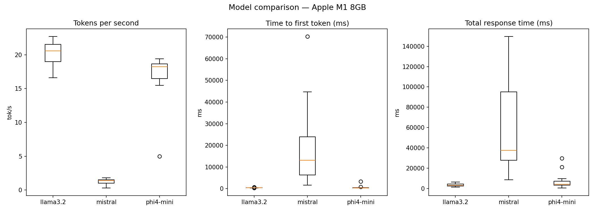

# Local LLM benchmarking tool

**Hardware:** Apple M1, 8GB unified memory  
**Inference engine:** Ollama (Metal GPU acceleration)  
**Test set:** 12 prompts across 5 categories (reasoning, summarization, extraction, classification, code)

---

## Models tested

| Model | Params | Quantization | Disk size |
|---|---|---|---|
| llama3.2:3b | 3B | fp16 | ~2.0 GB |
| phi4-mini | 3.8B | fp16 | ~2.5 GB |
| mistral:7b-instruct-q4_K_M | 7B | Q4_K_M | ~4.1 GB |

---

## Results

### Overall performance

| Model | Avg tok/s | P50 tok/s | Avg TTFT (ms) | P95 TTFT (ms) | Avg duration (ms) |
|---|---|---|---|---|---|
| llama3.2:3b | 20.2 | 20.6 | 402.8 | 566.6 | 3,385.9 |
| phi4-mini | 16.8 | 18.2 | 634.5 | 1,931.3 | 7,574.0 |
| mistral:7b-instruct-q4_K_M | 1.2 | 1.4 | 19,776.9 | 56,212.7 | 62,909.6 |

### Performance by category (avg tok/s)

| Category | llama3.2:3b | phi4-mini | mistral:7b-q4 |
|---|---|---|---|
| classification | 19.8 | 12.2 | 0.8 |
| code | 21.0 | 18.8 | 1.4 |
| extraction | 17.9 | 16.7 | 0.8 |
| reasoning | 21.7 | 17.9 | 1.5 |
| summarization | 21.0 | 18.0 | 1.7 |

---

## Key findings

**1. Mistral 7B Q4 is not viable on M1 8GB**  
At 1.2 tok/s average and a P95 TTFT of 56 seconds, Mistral is effectively unusable for interactive inference on this hardware. The Q4_K_M quantized model occupies ~4.1GB, leaving insufficient headroom in the 8GB unified memory pool for efficient Metal GPU utilization. For 7B+ models, 16GB unified memory (M1 Pro/Max) is the practical minimum.

**2. Llama 3.2 3B is the best choice for M1 8GB**  
20.2 tok/s average with a 403ms mean TTFT makes it genuinely responsive for interactive use. It was the fastest across every category and the most consistent (tight P50/avg spread).

**3. Phi4-mini trades speed for reasoning depth**  
Phi4-mini ran 17% slower than Llama 3B overall, but its reasoning task duration (11.9s vs 5.0s) suggests it generates longer, more thorough responses. For tasks where output quality matters more than latency, phi4-mini is worth the tradeoff.

**4. Extraction tasks are fastest across all models**  
Extraction prompts produced the shortest responses (factual, bounded output), leading to the lowest average duration for all three models. Code and reasoning tasks produced the longest responses.

---

## Temperature experiment

Tested llama3.2:3b on 5 prompts, 3 runs each at temperature 0.0 and 0.7.

| Prompt | Temp 0.0 | Temp 0.7 |
|---|---|---|
| What is the capital of Australia? | identical | identical |
| Name three programming languages used for data engineering | identical | 3 variants |
| What does API stand for? | identical | 3 variants |
| List two advantages of using vector databases | identical | 3 variants |
| What is the difference between supervised and unsupervised learning? | identical | 3 variants |

**Finding:** Temperature 0.0 is fully deterministic. At 0.7, single-answer factual prompts stay stable while open-ended prompts produce unique variants every run. For production extraction pipelines, temperature 0.0 is the correct choice.

---

## Structured output pipeline

Built a JSON extraction pipeline with Pydantic validation and a retry-with-reprompt loop:

1. Prompt the model with a strict JSON schema at temperature 0.0
2. Strip any markdown fences from the response
3. Validate against a Pydantic model
4. On failure, reprompt once with the specific validation error included
5. Return None if both attempts fail — never hallucinate a fallback

---

## Recommendation

For local inference on Apple Silicon M1 8GB:

- **Interactive assistant / chatbot:** llama3.2:3b — best latency, fully usable
- **Structured extraction pipeline:** llama3.2:3b at temp 0.0 — fast and deterministic
- **Quality-sensitive reasoning tasks:** phi4-mini — worth the 2x latency tradeoff
- **7B models:** Require 16GB+ unified memory — not viable on base M1

---

## Project structure
local-llm-bench/
├── README.md
├── requirements.txt
├── src/
│   ├── ollama_client.py
│   ├── api.py
│   ├── benchmark.py
│   ├── structured_runner.py
│   ├── temperature_experiment.py
│   ├── compare_models.py
│   └── plot_results.py
├── data/
│   ├── prompts/
│   │   └── benchmark_prompts.yaml
│   └── results/
└── reports/
├── model_comparison.csv
└── model_comparison.png
